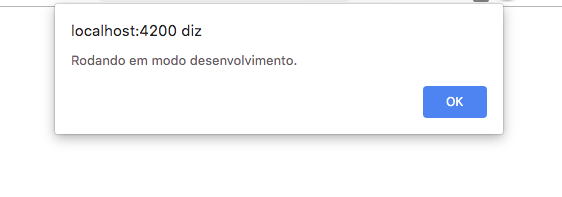

# Build

## Criando um build simples

Vamos criar um build de desenvolvimento para nossa aplicação e verificar algumas das funcionalidades do Angular CLI para usar variáveis de ambiente em sua aplicação.

Vamos explorar variáveis de ambiente e o que elas significam no app.

* Abra a pasta src/ e note a pasta environments.
* Note os dois arquivos dentro: environment.prod.ts e environment.ts. Abra environment.ts que deve estar assim:

`environment.ts`
```typescript
export const environment = {
  production: false,
  baseUrl: '//localhost:8080'
};
```

Esse é o environment padrão, para builds de desenvolvimento.

Veja que além da flag "production: false", nossa API de desenvolvimento também é colocada aqui, de forma que diferenciamos o backend da produção e desenvolvimento.

Agora, abra `src/main.ts`, deve estar assim:

`src/main.ts`
```typescript
import { enableProdMode } from '@angular/core';
import { platformBrowserDynamic } from '@angular/platform-browser-dynamic';

import { AppModule } from './app/app.module';
import { environment } from './environments/environment';

if (environment.production) {
  enableProdMode();
}

platformBrowserDynamic().bootstrapModule(AppModule)
  .catch(err => console.error(err));
```

Note o seguinte import:

```typescript
import { environment } from './environments/environment';
```

Ele realiza o import do environment apropriado para a aplicação. Agora note esse trecho:

```typescript
if (environment.production) {
 enableProdMode();
}
```

O Angular possui otimizações de desempenho especificamente para builds de produção. Você pode ver aqui que o objeto environment é usado para determinar se o build é de produção ou não.

Agora, adicione um alerta que vai disparar se a aplicação rodar em modo desenvolvimento.

Coloque isso como um bloco else dessa forma:

```typescript
import { enableProdMode } from '@angular/core';
import { platformBrowserDynamic } from '@angular/platform-browser-dynamic';
import { AppModule } from './app/app.module';
import { environment } from './environments/environment';


if (environment.production) {
 enableProdMode();
} else {
 alert('Rodando em modo desenvolvimento.');
}

platformBrowserDynamic().bootstrapModule(AppModule)
 .catch(err => console.error(err));
```

Rode o projeto com ng serve e verifique o localhost:4200 no browser e observe o abaixo:



A caixa de alerta dispara porque estamos rodando em modo desenvolvimento por padrão.

Agora finalize a execução e digite ng build. Ao finalizar, uma pasta `dist/` terá sido criada, dentro dela haverá uma pasta com todos os arquivos necessários para rodar a aplicação, minificada (produção otimiza ainda mais) e pronta para ser subida para o servidor.

## Criando um build de produção

No build de desenvolvimento é possível notar vários arquivos JavaScript e seus respectivos `.map` para que seja possível depurar a aplicação. 

Muitos deles sequer são minificados completamente. Assim, vamos explorar o build de produção para comparar.


Agora rode `ng serve --prod`. 

Ele vai reclamar por não termos configurado o `baseUrl`, altere o arquivo `environment.prod.ts` para ficar assim:

```typescript
export const environment = {
 production: true,
 baseUrl: '//localhost:8080'
};
```

Feito isso, novamente fazer `ng serve --prod`.

Esse comando vai fazer a mesma função que o `ng serve`, que é criar um build do nosso código e depois lançar um servidor virtual para testes locais, mas ele vai usar o environment de produção. 

Vai ser lançado um aviso dizendo que o servidor virtual não é feito para ser usado em produção.

Apesar de não poder ser usado em produção de verdade, é muito útil para testar a aplicação final em modo de produção antes de liberar para outras etapas da entrega do produto.

A compilação segue sem problemas e conseguimos acessar o sistema normalmente.

Note que a caixa de diálogo do modo desenvolvimento não dispara mais. 

A aplicação aparece mais rapidamente na tela e é mais responsiva.


A principal razão para isso é o Ahead of Time Compilation (AOT). 

AOT acelera a aplicação dramaticamente por meio da pré-compilação de todos os bindings das views (onde usamos {{}}), tornando os templates prontos para executar ao custo deles não poderem ser modificados. 

A outra razão para a melhora de desempenho é por conta da minificação significativamente maior, e também mais tree-shaking (eliminação de código não usado) durante o processo de build. 

Por fim, o `enableProdMode()` é usado, permitindo certas otimizações ao custo de não ser possível depurar.

O resultado é uma aplicação muito mais rápida e mais difícil de aplicar engenharia reversa.

Agora vamos rodar o comando:

```
$ ng build --configuration production --aot=true
```

Na pasta `/dist` a diferença nos arquivos gerados são muitas. Não há mais arquivos `.map`. 

A pasta de estilos agora é um `.css` e não um `.js`.

Isso é porque o build extrai os estilos presentes dentro dos `.js` para um `.css` global para melhoria de desempenho.

Note também o arquivo 3rdpartylicenses com todas as licenças apropriadas para as bibliotecas que são usadas pela aplicação.

O `main.(aleatorio).js` (aleatorio sendo a string gerada automaticamente) também está completamente minificado.

E com isso temos uma dist de produção pronta para ser disponibilizada para nossos usuários.

https://angular.io/cli/build

## Deploy com Docker

Vamos testar nosso build com o NGINX criando dois arquivos na raiz do nosso projeto.


Criar o seguinte Dockerfile:

`Dockerfile`
```dockerfile
FROM nginx

COPY nginx.conf /etc/nginx/nginx.conf

WORKDIR /usr/share/nginx/html

COPY dist/supermarkt-ui/ .
```

Criar o nginx.conf:

`nginx.conf`
```
worker_processes  1;

events {
   worker_connections  1024;
}

http {
   server {
       listen 80;
       server_name  localhost;
       root   /usr/share/nginx/html;
       index  index.html index.htm;
       include /etc/nginx/mime.types;
       gzip on;
       gzip_min_length 1000;
       gzip_proxied expired no-cache no-store private auth;

       gzip_types text/plain text/css application/json application/javascript application/x-javascript text/xml application/xml application/xml+rss text/javascript;

       location / {
           try_files $uri $uri/ /index.html;
       }
   }
}
```

Construir a imagem a partir do Dockerfile:

```
$ docker build -t supermarkt .
```

Rodar o container da nossa imagem:

```
$ docker run --name supermarkt -itd -p 8222:80 supermarkt
```

Verifique a aplicação rodando na porta 8222 e interaja normalmente.
