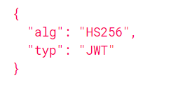
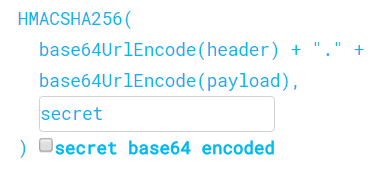
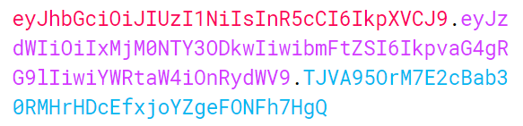

# JWT

O JWT é um padrão ([RFC-7519](https://www.google.com/url?q=https://tools.ietf.org/html/rfc7519&sa=D&source=editors&ust=1620167555295000&usg=AOvVaw1jJ1SgGA9biUqdBWh2YPzj)) de mercado que define como transmitir e armazenar objetos JSON de forma compacta e segura entre diferentes aplicações. Os dados nele contidos podem ser validados a qualquer momento pois o token é assinado digitalmente.


Ele é formado por três seções: **Header**, **Payload** e **Signature**.

## Header

O Header é um objeto JSON que define informações sobre o tipo do token (typ), nesse caso JWT, e o algoritmo usado em sua assinatura (alg), normalmente [HMAC SHA256](https://www.google.com/url?q=https://tools.ietf.org/html/rfc2104&sa=D&source=editors&ust=1620167555296000&usg=AOvVaw2NQ-KwfxUw5ftcsFKQQ6aT) ou [RSA](https://www.google.com/url?q=https://tools.ietf.org/html/rfc8017&sa=D&source=editors&ust=1620167555296000&usg=AOvVaw2D0ecMKh6UUlCWluz7VrNu).



## Payload

O Payload é um objeto JSON com as Claims (informações) da entidade tratada, normalmente o usuário autenticado.

Essas claims podem ser de 3 tipos:

Reserved claims: atributos não obrigatórios (mas recomendados) que são usados na validação do token pelos protocolos de segurança das APIs.

```
sub (subject) = Entidade a quem o token pertence, normalmente o ID do usuário;

iss (issuer) = Emissor do token;

exp (expiration) = Timestamp de quando o token irá expirar;

iat (issued at) = Timestamp de quando o token foi criado;

aud (audience) = Destinatário do token, representa a aplicação que irá usá-lo.
```

Geralmente os atributos mais utilizados são: **sub**, **iss** e **exp**.

Public claims: atributos que usamos em nossas aplicações. Normalmente armazenamos as informações do usuário autenticado na aplicação.

```
name
roles
permissions
```

Private claims: atributos definidos especialmente para compartilhar informações entre aplicações.


Por segurança recomenda-se não armazenar informações confidenciais ou sensíveis no token.

## Signature

A assinatura é a concatenação dos hashes gerados a partir do Header e Payload usando base64UrlEncode, com uma chave secreta ou certificado RSA.



Essa assinatura é utilizada para garantir a integridade do token, no caso, se ele foi modificado e se realmente foi gerado por você.

Isso previne ataques do tipo man-in-the-middle, onde o invasor poderia interceptar a requisição e modificar seu conteúdo, desta forma personificando o usuário com informações falsas. Caso o payload seja alterado, o hash final não será válido pois não foi assinado com sua chave secreta.

Apenas quem está de posse da chave pode criar, alterar e validar o token.

## Resultado final

O resultado final é um token com três seções (header, payload, signature) separadas por “.” — ponto.



## Usando o token

Ao fazer login em um serviço de autenticação um token JWT é criado e retornado para o client. Esse token deve ser enviado para as APIs através do header **Authorization** de cada requisição HTTP com a flag **Bearer**, conforme ilustra o diagrama abaixo.

`Authorization: Bearer <token>`


Em posse do token, a API não precisa ir até o banco de dados consultar as informações do usuário, pois já temos suas credenciais de acesso contido no próprio token JWT.


