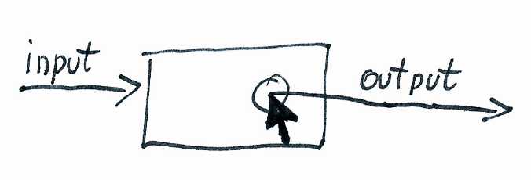
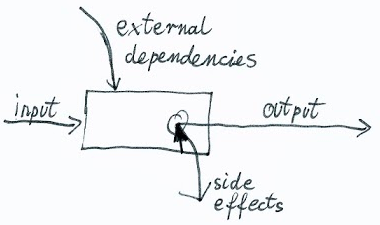

# Componentização

## Problema

Escrever novos componentes é fácil, mas modificá-los e estendê-los não é. Especialmente quando você tem centenas deles, e você quer evitar quebrá-los.

Independente do framework (Angular / React / Vue), as mesmas questões sempre aparecem:


* Onde eu guardo o estado de X?
* Como eu mudo o estado de X?
* Se o estado de X depende de Y, como eu ligo essas dependências?
* Se eu posso resolver um problema P com a solução A, B ou C, qual eu devo escolher?

Exemplo de uma página de candidatos:


* Onde o estado deveria ficar guardado (filtros, dados, paginação)?
* PaginaDeBuscaComponent?
* PaginaDeBuscaService?
* Separar em vários componentes? (filtros em PaginaDeBuscaFiltrosComponent, resultados em PaginaDeBuscaComponent?)
* Se em CandidatoFiltroComponent eu precisar da lista de todos os candidatos, como eu consigo?

## Solução

* Dividir os componentes em Espertos (Smart) e Burros (Dumb)
* Mantenha os componentes o mais Burros possível
* Decidir quando um componente deve ser Esperto ao invés de Burro

### Dividir os componentes em Espertos/Contêiner (Smart/Container) e Burros/Apresentação (Dumb/Presentational)

**Componentes burros** também são conhecidos como componentes puros ou componentes de apresentação.


O componente burro é como uma função pura: uma função que para um determinado argumento, sempre vai retornar o mesmo valor.


Isso é, para certos dados (inputs/@Input()), o componente se comporta da mesma forma.


E no final, o componente burro emite eventos (output/@Output()).



**Componentes espertos** também são conhecidos como componentes impuros, conectados ou componentes contêiner.


O componente esperto é como uma função impura: a função toca o "mundo externo", seja para buscar dados de um serviço externo ou por produzir efeitos colaterais.




### Mantenha os componentes o mais Burros possível

Evite fazê-los dependentes de serviços externos. Se ele precisa de dados para funcionar, injete via @Input().

Errado:

```typescript
// errado (impuro)
class DateTimePickerComponent {
timeZone: string = 'America/Sao_Paulo';

constructor(
 private account: UserAccount
) {
 if (this.account.currentUser) {
  this.timeZone = this.account.currentUser.timeZone;
 }
}
}
```

Correto:

```typescript
// bom (puro)
class DateTimePickerComponent {
   @Input() timeZone: string = 'America/Sao_Paulo';
}
```

Evite produzir qualquer tipo de efeitos colaterais. Se ele precisa emitir alguma coisa, emita através de @Output().


Errado:

```typescript
// errado (impuro)
class DateTimePickerComponent {
   timeZone: string = 'America/Sao_Paulo';

   changeTimeZone(timeZone: string) {
    this.timeZone = timeZone;
    this.accountRepo.updateCurrentUser({
     timeZone
    });
   }
}
```

Correto:

```typescript
// bom (puro)
class DateTimePickerComponent {
   @Input() timeZone: string = 'America/Sao_Paulo';
   @Output() timeZoneChange: EventEmitter<string> = new EventEmitter();

   changeTimeZone(timeZone: string) {
    this.timeZoneChange.emit(timeZone);
   }
}
```

Nunca altere um dado que veio via @Input(). Se for necessário alterar alguma coisa, emita a alteração como um evento, e então o componente pai vai capturar o evento e tratá-lo apropriadamente. Mudar um dado de @Input() é na verdade um efeito colateral que causa uma mudança no dado do componente pai.

```typescript
class MensagemItemComponent {
   @Input() mensagem: DadosMensagem;

   get mensagemNaoLida(): boolean {
    return this.mensagem._isNaoLida;
   }

   marcarMensagemComoLida(lida: boolean) {
    // muuuito errado
    // - nunca faça isso!
    this.mensagem._isNaoLida = !lida;

    this.mensagensRepo.marcarMensagemComoLida({
     id: mensagem.id,
     lida: lida
    });
   }
}
```

### Decidir quando um componente deve ser Esperto ao invés de Burro

#### Se pode ser Burro, faça ser Burro

TextInputComponent recebe um dado em string e eventulamente emite um evento valueChange:

```typescript
@Component(...)
class TextInputComponent {
@Input() value: string;
@Output() valueChange: EventEmitter<string>;
}
```

Nota: Se for necessário injetar e usar uma biblioteca JS externa para mostrar o date picker, não é um problema. Se o componente Burro tem um comportamento consistente de acordo com seus Inputs, e não causa efeitos colaterais que possam alterar o comportamento da aplicação principal, então está tudo certo.

#### Se múltiplos filhos são igualmente espertos, faça-os Burros

Se eles têm as mesmas dependências externas e efeitos colaterais, vamos movê-los para um pai Esperto e fazê-los burros.

Por exemplo, se a página de busca tem múltiplos filtros:

-UsuarioFiltroComponent
-AdminFiltroComponent
-FaixaDeDatasFiltroComponent

Então ao invés de ter uma dependência externa de 'PaginaBuscaService.filtros' em todos eles, apenas crie 'FiltrosComponent', que pega essa dependência e faça todos os componentes sub-filtros abaixo dele serem Burros.

#### O que não pode ser Burro, é Esperto

Por exemplo: os componentes de view de mais alto nível.


Porque mesmo se nós fizermos todos Burros, pelo menos alguém tem que ser Esperto, aquele que de fato salva os dados, obtém dados das APIs, etc.

#### Se o Esperto fica muito grande, divida-o em Espertos separados

"Faça o componente de view principal Esperto", é uma boa regra, mas em algumas views, isso pode não ser suficiente.

Tome o Gmail de exemplo, a caixa de entrada principal tem as seguintes funcionalidades:

* lista as mensagens recentes na pasta e deixa você interagir com elas
* lista as pastas disponíveis e deixa você modificá-las
* mostra pessoas online do Hangout
* permite escrever uma mensagem nova rapidamente

Se fossemos ter apenas um componente Esperto na nossa página Gmail, então ele teria que ter todas essas responsabilidades, o que é bastante!


Ao invés disso, nós podemos dividir em alguns componentes Espertos com suas respectivas responsabilidades:

* View das mensagens
* View das pastas
* View do Hangout
* View de nova mensagem

## Prós e contras da separação em Esperto/Burro

**Prós:**

* Você pode facilmente predizer o comportamento dos componentes Burros
    * O comportamento é tão simples quanto os Inputs e Outputs públicos da interface, os quais, ainda por cima, junto com a tipagem do TypeScript, são uma ótima documentação.

* Você pode facilmente testar o comportamento dos componentes Burros
    * Para testar basta: definir os Inputs, instanciar o componente, fazer uma ação no componente (clicar), verificar que um @Output() específico foi emitido
    * Testar componentes Espertos geralmente requer muito mais que isso: fazer mock de dependências externas, checar efeitos colaterais. etc.

* Você pode de forma relativamente fácil mudar o comportamento dos componentes burros sem quebrar o resto
    * Sempre que alterar um componente Burro, tenha certeza que a interface antiga ainda funciona, ou busque e substitua em todos os lugares onde o componente é usado, o que pode ser feito facilmente graças ao TypeScript. E tenha certeza que o Componente ainda mantém seu comportamento
    * Você não precisa verificar se alguma dependência externa quebra este componente, ou se ele produz outros efeitos colaterais que não tinha antes. Nunca teve, nunca terá.

* A lógica principal da aplicação é controlada apenas por componentes Espertos
    * Você não precisa ler todo os seu repositório de código, apenas para ver quem está buscando o que e quando e o que está mudando o que e quando. Isso porque o que está acontecendo nos níveis mais baixos da árvore podem ser vistos apenas olhando para o template HTML
    * Se você precisar alterar a lógica principal da sua aplicação, geralmente você não precisa nem tocar nos componentes Burros, ou, a única coisa que você precisa alterar neles, são os valores de Input

* O desempenho é melhor
    * Porque agora você sabe exatamente o que depende de que.

* Ajuda a evitar bugs
    * Menos acoplamento de código; separar em pedaços menores e mais SOLID; evitar efeitos colaterais, etc. Tudo isso diminui a complexidade do código e ao mesmo tempo diminui a chance de bugs.
    * Agora que a maior parte da sua aplicação depende de interfaces tipadas de Inputs e Outputs, diminuem as chances de bugs causados por erros de digitação ou tipos de dados passados errados.


**Contras:**


* Você não pode injetar dependências sempre que quiser
* Você não pode mudar os dados passados através de Input/Output
